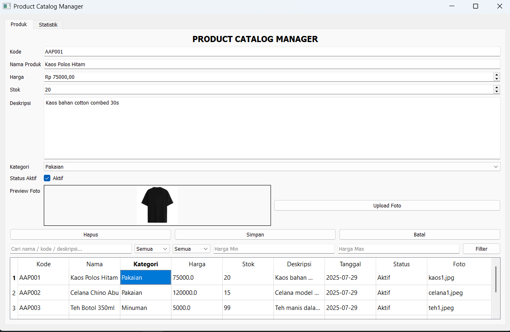
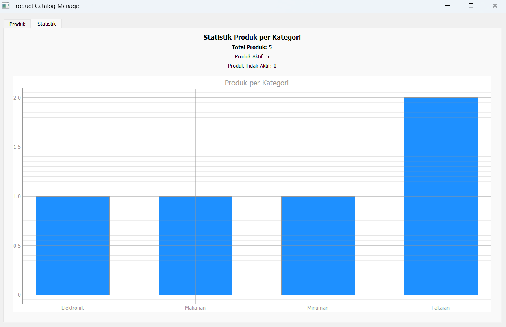

# Product Catalog Manager (Desktop App)

Aplikasi desktop manajemen katalog produk berbasis **Python (PyQt5)** untuk membantu UMKM mengelola data produk secara lokal.

---

## 📚 Fitur Utama

* **CRUD Produk**: Tambah, edit, hapus, dan lihat produk
* **Filter & Pencarian**: Berdasarkan nama, kategori, status, harga
* **Upload Foto Produk**: Simpan dan tampilkan preview foto
* **Statistik**: Visualisasi produk per kategori dalam bentuk chart
* **Tampilan Multi-tab**: Form + Tabel & Statistik terpisah dalam tab

---

## 🔧 Teknologi yang Digunakan

* Bahasa: Python 3.11
* GUI: PyQt5
* Chart: PyQtGraph
* Database: SQLite3
* Build: PyInstaller

---

## 📂 Struktur Folder

```
Product-Catalog-Manager/
├── app/
│   └── logic.py
├── db/
│   └── aap_store.db
├── foto/
├── ui/
│   └── form_produk.ui
├── main.py
├── dist/
│   └── main.exe  ← file hasil build
```

---

## 🔧 Cara Menjalankan (Via Source Code)

1. Pastikan Python 3.11 terinstal
2. Install dependency:

```bash
pip install -r requirements.txt
```

3. Jalankan aplikasi:

```bash
python main.py
```

---

## 🌐 Link Deployment

> Karena aplikasi ini berbasis desktop, deployment dilakukan via link unduhan `.exe`:

**Link Google Drive:** [Klik untuk unduh](https://drive.google.com/drive/folders/1sNTCbz0L7oOs5Q-klmrqvt_xStOnJ04k?usp=drive_link)

---

## 🔐 Akun Testing

> Tidak dibutuhkan. Aplikasi ini tidak menggunakan login sistem.

---

## 📊 Preview Tampilan




---

## 🚀 Build Menjadi .EXE (Opsional)

```bash
pyinstaller --onefile --windowed \
  --add-data "ui/form_produk.ui;ui" \
  --add-data "db/aap_store.db;db" \
  --add-data "foto;foto" \
  main.py
```

Output: `dist/main.exe`

---

## 🙌 Author

* Nama: \[Rudy]
* Capstone Project: Aplikasi Manajemen Produk UMKM


---

> Dibuat sebagai bagian dari Capstone Project - Studi Independen Bersertifikat 2025.
